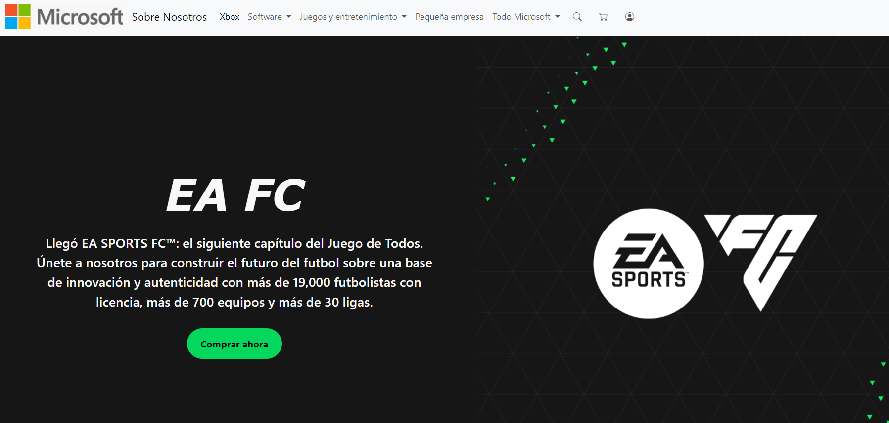

<h1 align="center">
  <br>
 
  <br>
  Microsoft Game Store
  <br>
</h1>


Bienvenido al clon de la Microsoft Game Store, una plataforma diseñada para ofrecer una experiencia de compra y descarga de juegos similar a la reconocida tienda de videojuegos de Microsoft. Este proyecto tiene como objetivo proporcionar a los usuarios una alternativa accesible y funcional para descubrir, adquirir y disfrutar de una amplia variedad de títulos de videojuegos.


## Previsualizacion
<a align="center" href="#"></a>

## Autores

- [Luciano Cabello](https://github.com/Lucianocabelloo)
- [Joaquin Medina](https://www.github.com/cacho-medina)
- [Mauro Armas](https://github.com/mauroarms)
- [Nicolas Saavedra](https://www.github.com/Nicholas027)
- [Lucia Barraza](https://www.github.com/mluchyb)


## Instalacion


```bash
# Clonar este repositorio
$ git clone https://github.com/mauroarms/Proyecto2_RC_MSFTGames.git

# Entrar en el repositorio
$ cd Proyecto2_RC_MSFTGames

```

## Tecnologias

<ul>
  <li>
    
  </li>
  <li>
    
  </li>
  <li>
    
  </li>
  <li>
    
  </li>
  <li>
    
  </li>
  <li>
    
  </li>
</ul>
